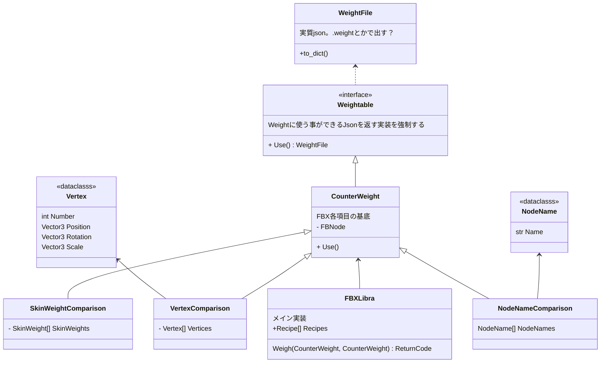

# fbx-Libra
Tools to compare fbx files.  
The name of the tool was inspired by the word "compare," and was named after the constellation Libra.

# Design Doc

## 背景、目的
- ○○ expoorterやfbxファイルに関係する機能を実装した時、正しい状態かどうかを簡単に確認したい
- 通常確認する場合、書き出しからゲームエンジンにインポートし、表示というフローを取る必要があり、時間がかかる。

## 達成したいこと
- fbx同士を比較し、指定した項目が同じかどうかを簡単に確認する

## 設計
### 項目
- 頂点
- ウェイト
- ノード名
- アニメーション (できれば)

## 言語候補
- python
  - pytestに対応できる
  - 書くの簡単
- rust
  - FBX SDKがC++なので、Bindingかけばいける
  - dllにしてpython呼び出しも可能
  - exe化が容易
  - かなりの趣味枠

## やらないこと
- fbx以外のファイルフォーマット

## 雑クラス図

