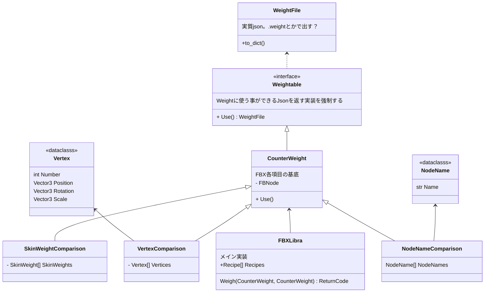

# 雑クラス図

```mermaid
classDiagram

class FBXLibra{
    メイン実装
    +Recipe[] Recipes
    Weigh(CounterWeight, CounterWeight) ReturnCode
}

class WeightFile{
    実質json。.weightとかで出す？
    +to_dict()
}

class Weightable {
    Weightに使う事ができるJsonを返す実装を強制する
    <<interface>>
    + Use() WeightFile
}

WeightFile　<.. Weightable

class CounterWeight {
    FBX各項目の基底
    - FBNode
    + Use() 
}

Weightable <|-- CounterWeight
CounterWeight <|-- VertexComparison
class VertexComparison{
    - Vertex[] Vertices
}

class Vertex{
    <<dataclasss>>
    int Number
    Vector3 Position
    Vector3 Rotation
    Vector3 Scale
}

Vertex <-- VertexComparison

class SkinWeightComparison {
    - SkinWeight[] SkinWeights
}
CounterWeight <|-- SkinWeightComparison

class NodeNameComparison {
    NodeName[] NodeNames
}

class NodeName {
    <<dataclasss>>
    str Name
}

NodeName <-- NodeNameComparison
CounterWeight <|-- NodeNameComparison

CounterWeight <-- FBXLibra
```
